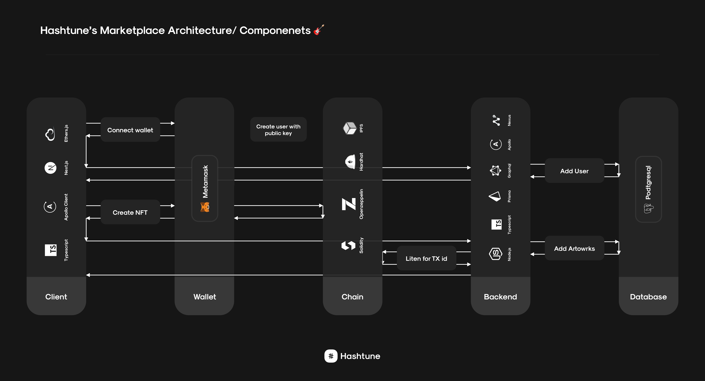
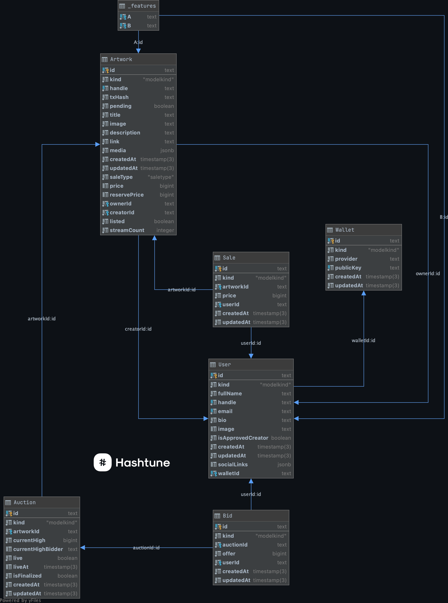

# **Hashtune Marketplace Server**

  
## Architecture 🏛

The architecutre consists of 3 repositories:

1. [Client](https://github.com/hashtune/Hashtune-Marketplace-Client)
2. [Server](https://github.com/hashtune/Hashtune-Marketplace-Server)
3. [Smart Contracts (currently on the Binance Test Network)](https://github.com/hashtune/Hashtune-Marketplace-Chain)

Each repository has its own steps for set up, development, and testing. This document only covers the server.

---

## Setup 🏗

You need to crate the following files in the root directory:

- `.env.local`, containing a `DATABASE_URL` variable corresponding to the postgres DB from the docker-compose file, and `STAGE="development"`;

- `.env.test`, containing a `DATABASE_URL` variable corresponding to the postgres DB from the docker-compose file, and `STAGE="test"`.

Run `yarn` to install the dependencies;

---

## Development 🚀

Run the following commands to start a development server:

1. `yarn docker:up` To start the database locally;

2. `yarn prisma:migrate` To migrate the database;

3. `yarn prisma:generate` To generate the client;

4. `yarn nexus:watch` In another terminal tab, to generate a GraphQL type file in `node_modules/@types/nexus-typegen/index.d.ts` and a GraphQL schema file called `schema.graphql`. Do NOT edit these files;

5. `yarn dev` In another terminal tab, to start the server on port 5000. Optionally override the port in .env;

6. `yarn cron` In another terminal tab, to start the hourly cron that will be run in production to sync the chain and the server;

7. `yarn data:seed` To create some seed data (same data used in API tests).

You can now visit `http://localhost:5000/graphql` for the playground.

---

## Testing 🧪

Different options are available for testing the server, you can run:

- `yarn test:watch` To run API integration tests in watch mode while writing them;

- `yarn test:api` To run API integration tests;

- `yarn test:api -u` To update API integration test snapshots.

---

## Security 🕵️‍♂️

Security is a top-level priority for us. To know more about all the security measures we implemented in our server, see our [SECURITY.md file](https://github.com/hashtune/Hashtune-Marketplace-Server/blob/main/README/SECURITY.md).

---

## Types, Queries, and Mutations 🗂

Data Types, Queries, and Mutations are defined in the `./graphql/types/` folder. Since we used a code-first approach, everything is defined with the nexus  library using `objectType` and `extendType`.

### Types

We can differentiate between 3 kinds of types: Data Types, Error Types, and Return Types.

---

#### Data Types

Data Types represent the models defined in the `schema.prisma` file.

Defining the corresponding GraphQL Object Types, which contain identical informations that we have defined in our database schema

| Name |
|------|
| Artwork |  
| Auction | 
| Bid | 
| Errors|
| User |
| Wallet |

---

#### Error Types

Error Types are currently used to give the client more information about what went wrong in a request in case of error. We could remove these types for security reasons once we launch our product.

<b>Error Types table</b>

  
 

| Name | Properties |
|----|---|
| ClientErrorArgumentsConflict | `path`: String, `message`: String|
| ClientErrorArtworkNotFound | `message`: String|
| ClientErrorAuctionAlreadyExists | `message`: String|
| ClientErrorArtworkNotAnAuction | `message`: String |
| ClientErrorAuctionNotFound | `message`: String|
| ClientErrorAuctionNotDeletable | `message`: String |
| ClientErrorUserUnAuthorized | `message`: String|
| ClientErrorUserNotFound | `message`: String|
| ClientErrorJWTInvalid | `message`: String |
| ClientErrorInvalidHandle| `message`: String|
| ClientErrorHandleAlreadyExists | `message`: String |
| ClientErrorUnkown | `message`: String|
| externalChainError | `message`: String |  
| externalChainErrorStillPending | `message`: String |
  

---

#### Return Types

Return Types are used to wrap and return Data Types and Error Types.

| Name | Type | Errors Number |
|----|---|--|
| ArtworkResult | Artworks: Artwork[] | 6 |
| AuctionResult | Auctions: Auction[] | 7 |
| UserResult | Users: User[] | 5 | 

---

### Queries 

All the input mentioned inputs that are optional have `?` sign

| Name  | Description | Input | Return value | 
|--------|----|---|---|
| FindArtwork | Find an artwork by its unique ID | `id` STRING | `ArtworkResult` |
| FindUser | Finding a user by their handle or wallet public key | `handle` String?, `publikKey` String? |  `UserResult` |
| ListArtowrks | Finding artworks. Optionally filtered by their `saleType` or status | `auction` Boolean?, `listed` Boolean?, | `ArtworkResult` |
| ListCreators | Returns users with the status of `approvedCreator` | N/A | `userResult` |

You can find the most recent queries in the Apollo Server Sanbox as we add more

---

### Mutations

Mutation are used to perform operation on our GraphQl resources

> Input types aren't listed in this table, you can find them in teh Apollo Sanbox

| Name  | Description | Return Value|
|--------|----|---|
| AddArtwork | Creating an artwork | `ArtworkResult` |
| UpdateArtwork | Updating an artwork's data | `ArtworkResult`|
| AddAuction | Creating a new auction | `AuctionResult` |
| deleteAuction | Deletes an auction that has no active bids | `AuctionResult` |
| registerUser | User registration | `UserResult` |
| updateUser | Update a user's profile data | `UserResult` |

You can find the most recent mutations in the Apollo Server Sanbox as we add more

---

## Database Entity-Relationship Model 📌

 

---

## Contributions 

Please refer to the [Sprint Board](https://github.com/orgs/hashtune/projects/1) and the [Pull Requests History](https://github.com/hashtune/Hashtune-Marketplace-Server/pulls?q=is%3Apr) for more information about contribution history.
